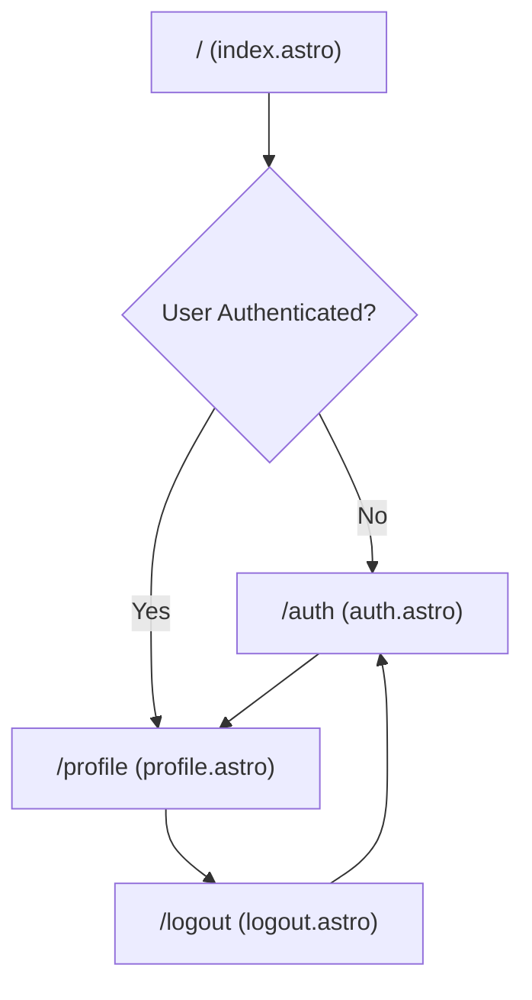
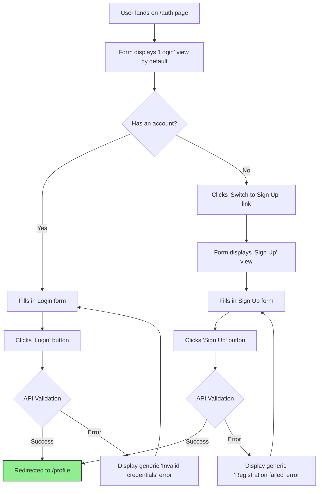

# UI/UX Specification: Production-Ready Auth Starter Kit

_This document defines the user experience, user interface, and design principles for the v1.0 MVP._

_Document created on: 2025-07-22_ _Facilitator: UX Expert Agent_

## 1. Introduction & UX Goals

This document defines the user experience goals, information architecture, user flows, and visual
design specifications for the Authentication Starter Kit. It serves as the foundation for frontend
development, ensuring a cohesive and user-centered experience.

### 1.1. Target User Personas

- **The Professional Developer (Primary):** Experienced, values best practices, and needs a tool
  that is powerful, un-opinionated, and fast. They are comfortable with code and want a foundation
  that "just works" without getting in their way.
- **The Open-Source User (Secondary):** May have varying skill levels. They need clear
  documentation, an intuitive setup process, and a project that serves as a good learning example
  for modern web development.

### 1.2. Usability Goals

- **Efficiency:** The starter kit should be usable and running in a new project in under 5 minutes.
- **Clarity:** The file structure, code, and documentation should be so clear that a new user can
  understand the architecture without needing to ask questions.
- **Extensibility:** It should be easy to add new features or remove unwanted ones without breaking
  the core system.

### 1.3. Design Principles

1. **Convention over Configuration:** For the core MVP, provide sensible defaults that work
   out-of-the-box. Advanced configuration should be possible, but not required.
2. **Minimalist & Un-opinionated:** The UI should be clean, simple, and stylistically neutral,
   making it easy to adapt to any project's branding.
3. **Accessible by Default:** All UI components must meet modern accessibility standards from the
   start.

---

## 2. Information Architecture (IA)

### 2.1. Site Map

### 2.2. Navigation Structure

- **Primary Navigation:** A simple header that will be dynamically rendered based on the user's
  authentication status.
  - **Logged Out State:** Shows links for "Home" and "Login".
  - **Logged In State:** Shows links for "Home", "Profile", and a "Logout" button.
- **Breadcrumbs:** Not required for the simple v1.0 structure.

---

## 3. User Flows

### 3.1. Login & Registration Flow (Secure)

- **User Goal:** To securely access their account, whether they are a new or existing user.
- **Entry Point:** The user navigates to the `/auth` page.
- **Success Criteria:** The user is successfully logged in and redirected to their protected profile
  page.

---

## 4. Branding, Components, and Wireframes

### 4.1. Branding & Style Guide

- **Color Palette:**
  - **Background:** Dark cool-grays (`zinc-900`, `zinc-800`).
  - **Text:** Off-white (`neutral-100`).
  - **Primary Accent / Links:** Clear, accessible blue (`sky-300`).
  - **Interactive Accent / Hover:** Warm, noticeable amber (`amber-200`).
  - **Success:** A standard green for positive feedback.
  - **Error:** A standard red for error messages.
- **Typography:** System `font-sans`. A simple, clean type scale will be defined in Tailwind for
  headings and body text.
- **Spacing:** A standard 4-point spacing scale (managed by Tailwind defaults) for all layout
  spacing.

### 4.2. Component Library

- **`Input` Component:** A styled text input with a label, placeholder, and an area for validation
  error messages.
- **`Button` Component:** A flexible button with variants for primary/secondary actions and disabled
  states.
- **`AuthForm` Component:** A smart component that manages the state for switching between Login and
  Sign Up views and handles form submission.

### 4.3. Key Screen Layouts

- **Authentication Page (`/auth`):** A single, centered card on the page containing a heading and
  the `AuthForm` component. The card will be full-width on mobile and have margins on larger
  screens.
- **Profile Page (`/profile`):** A simple, protected page that displays a welcome message and the
  authenticated user's email to confirm a successful login session.

---

## 5. Technical & Quality Standards

### 5.1. Accessibility

- **Compliance Target:** WCAG 2.1 AA.
- **Requirements:** Full keyboard navigation, clear focus indicators, high-contrast text, and
  semantic HTML for screen reader support.

### 5.2. Responsiveness

- **Strategy:** Mobile-first design.
- **Breakpoints:** Standard Tailwind CSS breakpoints (`sm`, `md`, `lg`, `xl`) will be used to ensure
  the layout adapts gracefully to all screen sizes.

### 5.3. Performance

- **Goal:** A Lighthouse performance score of 95+.
- **Animation:** Motion will be used subtly and purposefully for user feedback (e.g., hover/focus
  states), not for complex decorative animations.
