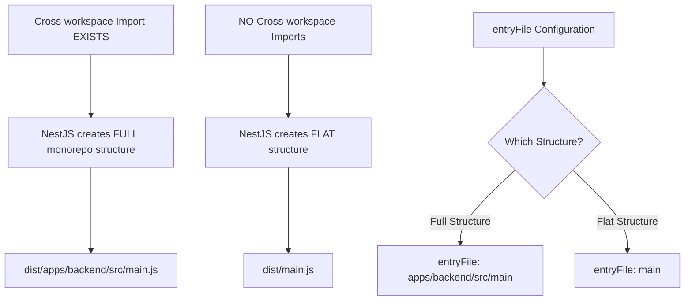

# System Patterns: Architecture & Design

## 🔍 Critical Discovery: NestJS Monorepo Compilation Behavior

### **The Discovery**

During Phase 1 implementation, we uncovered fundamental NestJS compilation behavior in monorepos:

**Core Principle:** NestJS CLI detects cross-workspace imports and changes compilation strategy



### **Why This Happens**

- **NestJS CLI** automatically detects cross-workspace dependencies
- When found → "This is a monorepo context" → Creates full project structure in dist/
- When not found → "This is a single project" → Creates flat structure in dist/
- **The `entryFile` in nest-cli.json must match the structure NestJS decides to create**

### **The Working Configuration**

```json
// nest-cli.json - MONOREPO COMPATIBLE
{
  "entryFile": "apps/backend/src/main",  // ← Handles full structure
  "sourceRoot": "src",                   // ← Relative to workspace
  "preserveWatchOutput": true
}

// tsconfig.json - PATH ALIASES
{
  "baseUrl": "./",                       // ← Relative to workspace root
  "paths": {
    "~/*": ["src/*"],                    // ← Local aliases work
    "@auth-system/types": ["../../packages/shared-types/src/index"]
  }
}
```

### **Critical Insights**

1. **Always maintain cross-workspace imports** - This ensures consistent monorepo behavior
2. **entryFile must match compilation output** - Not the source structure
3. **baseUrl should be workspace-relative** - Not nested paths
4. **This behavior is by design** - NestJS adapts to monorepo context automatically

### **Validation Commands**

```bash
# Test compilation structure
yarn build && find dist -name "main.js"

# Should output: dist/apps/backend/src/main.js (with cross-workspace imports)
```

## Backend Architecture: Hexagonal Pattern

### Core Principles

Following hexagonal architecture from
https://apprendre-la-programmation.net/architecture-hexagonale:

```
┌─────────────────────────────────────────────────────────┐
│                    Infrastructure                        │
│  ┌─────────────┐  ┌─────────────┐  ┌─────────────────┐  │
│  │   Database  │  │     HTTP    │  │   External APIs │  │
│  │   (Prisma)  │  │ Controllers │  │                 │  │
│  └─────────────┘  └─────────────┘  └─────────────────┘  │
│         │                 │                     │       │
└─────────┼─────────────────┼─────────────────────┼───────┘
          │                 │                     │
┌─────────┼─────────────────┼─────────────────────┼───────┐
│         │      Application Layer                │       │
│  ┌─────────────┐  ┌─────────────┐  ┌─────────────────┐  │
│  │ Repositories│  │   Services  │  │   Use Cases     │  │
│  │ (Interfaces)│  │             │  │                 │  │
│  └─────────────┘  └─────────────┘  └─────────────────┘  │
│         │                 │                     │       │
└─────────┼─────────────────┼─────────────────────┼───────┘
          │                 │                     │
┌─────────┼─────────────────┼─────────────────────┼───────┐
│         │         Domain Layer                  │       │
│  ┌─────────────┐  ┌─────────────┐  ┌─────────────────┐  │
│  │  Entities   │  │   Value     │  │   Domain        │  │
│  │             │  │   Objects   │  │   Services      │  │
│  └─────────────┘  └─────────────┘  └─────────────────┘  │
└─────────────────────────────────────────────────────────┘
```

### Layer Responsibilities

#### Domain Layer

- **Entities:** User, Profile (core business objects)
- **Value Objects:** Email, Password, UserId
- **Domain Services:** Password validation, user business rules
- **Interfaces:** Repository contracts

#### Application Layer

- **Use Cases:** LoginUser, RegisterUser, UpdateProfile, GetProfile
- **Services:** AuthenticationService, UserService
- **DTOs:** Request/Response objects
- **Interfaces:** External service contracts

#### Infrastructure Layer

- **Repositories:** PrismaUserRepository implementing domain interfaces
- **Controllers:** REST API endpoints
- **External Services:** Email, JWT token generation
- **Configuration:** Database, JWT secrets

### NestJS Module Structure (Simplified)

```
src/
├── auth/                    # Direct module access (simplified)
│   ├── domain/             # Entities, Value Objects, Interfaces
│   ├── application/        # Use Cases, Services, DTOs
│   └── infrastructure/     # Controllers, Repositories
├── user/                   # Direct module access (simplified)
│   ├── domain/
│   ├── application/
│   └── infrastructure/
├── shared/                 # Shared across modules
│   ├── domain/
│   ├── application/
│   └── infrastructure/
├── main.ts
└── app.module.ts
```

**Architecture Benefits:**

- ✅ Maintains hexagonal architecture integrity
- ✅ Reduces folder navigation depth (removed modules/ level)
- ✅ Easier to learn and work with
- ✅ Clear separation of concerns preserved

## Frontend Architecture: Component-Based

### Astro + React Pattern

```
src/
├── pages/              # Astro pages (routing)
├── components/         # React components
│   ├── ui/            # Reusable UI components
│   ├── forms/         # Form components
│   └── layouts/       # Layout components
├── hooks/             # Custom React hooks
├── utils/             # Utility functions
└── types/             # TypeScript definitions
```

### Component Patterns

#### Container Components

- Handle API communication
- Manage authentication state
- Coordinate child components

#### Presentational Components

- Pure UI rendering
- Receive data via props
- Emit events to parents

#### Form Components

- Use React Hook Form
- Handle validation
- Provide consistent UX

## Authentication Flow Pattern

### JWT Cookie Implementation

1. **Login:** Server sets httpOnly cookie with JWT
2. **Requests:** Cookie automatically included
3. **Validation:** Server validates JWT on each request
4. **Refresh:** Automatic token refresh mechanism
5. **Logout:** Server clears cookie

### Frontend State Management

```typescript
// Authentication context pattern
interface AuthContext {
  user: User | null
  login: (credentials: LoginDto) => Promise<void>
  register: (data: RegisterDto) => Promise<void>
  logout: () => Promise<void>
  updateProfile: (data: UpdateProfileDto) => Promise<void>
}
```

## Key Design Patterns

### Backend Patterns

- **Repository Pattern:** Data access abstraction
- **Use Case Pattern:** Single responsibility business operations
- **Factory Pattern:** Entity creation
- **Strategy Pattern:** Authentication strategies

### Frontend Patterns

- **Provider Pattern:** Authentication context
- **Custom Hooks:** Reusable stateful logic
- **Compound Components:** Complex UI composition
- **Error Boundaries:** Graceful error handling

## Testing Patterns

### Backend Testing

- **Unit Tests:** Domain entities and services
- **Integration Tests:** Use cases with mocked repositories
- **Contract Tests:** API endpoint validation

### Frontend Testing

- **Component Tests:** React Testing Library
- **Hook Tests:** Custom hook testing
- **Integration Tests:** User flow testing

## Security Patterns

### Backend Security

- Password hashing with Argon2
- JWT signature validation
- Input sanitization and validation
- Rate limiting on auth endpoints

### Frontend Security

- XSS prevention through React
- CSRF protection via SameSite cookies
- Secure form handling
- Input validation
